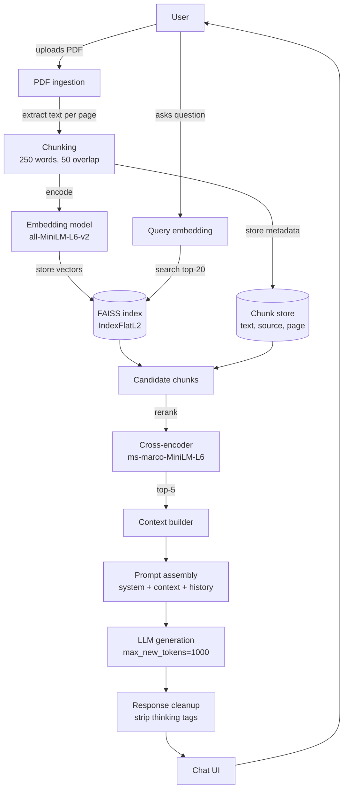

# Papyrus

A retrieval-augmented chatbot for PDF documents, built with Streamlit, FAISS, and a cross-encoder reranker on top of an open-source LLM.

## Table of contents

- [Demo](#demo)
- [Features](#features)
- [Architecture](#architecture)
- [Tech stack](#tech-stack)
- [Configuration](#configuration)
- [Getting started](#getting-started)
- [Project structure](#project-structure)
- [Evaluation](#evaluation)
- [Limitations](#limitations)
- [License](#license)

## Demo


## Features

- Multi-PDF upload with per-session indexing and de-duplication by filename
- Page-aware text extraction, so every retrieved chunk keeps its source file and page number
- Two-stage retrieval: FAISS similarity search (top 20) followed by cross-encoder reranking (top 5) for higher-precision context
- Answers are grounded in retrieved content; the model is instructed to say when something isn't in the uploaded documents instead of guessing
- Rolling chat history (last ~5 exchanges) to keep prompt size bounded
- Runs locally or from a hosted notebook (Colab/Kaggle) via a Cloudflare Tunnel, for GPU access without local infra

## Architecture

Two pipelines share one FAISS index: ingestion runs once per uploaded file, query runs on every chat message.



**Ingestion**
1. Text is extracted page by page with `pypdf`.
2. Each page is split into ~250-word chunks with a 50-word overlap.
3. Chunks are embedded with `all-MiniLM-L6-v2` and added to FAISS (`IndexFlatL2`); the chunk text, source filename, and page number are stored alongside in a parallel chunk store.

**Query**
1. The user's message is embedded and used to search FAISS for the top 20 nearest chunks.
2. Matching indices are looked up in the chunk store to assemble the candidate chunks.
3. Candidates are reranked with the cross-encoder; the top 5 become context for that turn.
4. Context, the system prompt, and the last 6 messages of history are assembled into a single prompt.
5. The LLM generates a response; residual `<reason>`/`<thinking>` tags are stripped before it's shown in the chat UI.

The assistant's persona is intentionally sarcastic/ironic (set in the system prompt) while staying grounded in retrieved content.

## Tech stack

| Layer | Technology |
|---|---|
| UI | Streamlit |
| PDF parsing | pypdf |
| Embeddings | sentence-transformers (`all-MiniLM-L6-v2`, 384-dim) |
| Vector store | FAISS (`IndexFlatL2`, in-memory, session-scoped) |
| Reranker | `cross-encoder/ms-marco-MiniLM-L6-v2` |
| LLM | `Qwen/WebWorld-8B` via Hugging Face `transformers` pipeline |
| Tunneling (notebook mode) | Cloudflare Tunnel (`cloudflared`) |

## Configuration

| Parameter | Value | Where |
|---|---|---|
| Chunk size | 250 words | `chunk_text()` |
| Chunk overlap | 50 words | `chunk_text()` |
| FAISS retrieval | top `min(20, total vectors)` | query handler |
| Reranked context | top 5 chunks | query handler |
| History sent to LLM | last 6 messages | `rag_messages` |
| History kept in session | trimmed above 11 messages | end of query handler |
| Generation | `temperature=0.5`, `top_p=0.9`, `max_new_tokens=1000` | `pipe()` call |

## Getting started

### Prerequisites

- Python 3.10+
- A CUDA-capable GPU is strongly recommended. An 8B-parameter model on CPU will be very slow to generate; the embedding and reranking models are lightweight enough to run on CPU on their own.

### Local

```bash
pip install -r requirements.txt
streamlit run app.py
```

### Notebook (Google Colab / Kaggle)

Originally developed and run in a notebook, which has no direct access to local ports. A Cloudflare Tunnel exposes the running Streamlit server through a temporary public HTTPS URL:

```bash
# Download and install Cloudflare Tunnel
!wget -q -nc https://github.com/cloudflare/cloudflared/releases/latest/download/cloudflared-linux-amd64.deb
!dpkg -i cloudflared-linux-amd64.deb > /dev/null

# Run Streamlit and expose it via Cloudflare
!streamlit run app.py & cloudflared tunnel --url http://localhost:8501
```

The tunnel URL (`*.trycloudflare.com`) appears in the cell output once both processes start; it changes on every run.

## Project structure

```
.
├── app.py            # Streamlit app: UI, ingestion, retrieval, and generation
├── requirements.txt
└── LICENSE
```

## Evaluation

No automated evaluation suite yet — no retrieval precision/recall metrics, no answer-faithfulness scoring. Validated through manual, interactive testing across multiple PDFs and query types; performs reliably for the intended use case.

## Limitations

- **Session-scoped storage** — the FAISS index and chunk store live in `st.session_state` and are lost on refresh or when the session ends. *Planned: persistent storage across sessions.*
- **Exact search only** — `IndexFlatL2` performs brute-force search and won't scale to large document collections. *Planned: a better search/indexing approach.*
- **No per-document scoping** — all uploaded documents in a session share one index; retrieval can't be filtered to a specific file. *Planned: per-document scoping.*
- **No automated evaluation** — see [Evaluation](#evaluation). *Planned: an automated evaluation suite.*

## License

This project is licensed under the MIT License. See [LICENSE](LICENSE) for details.
